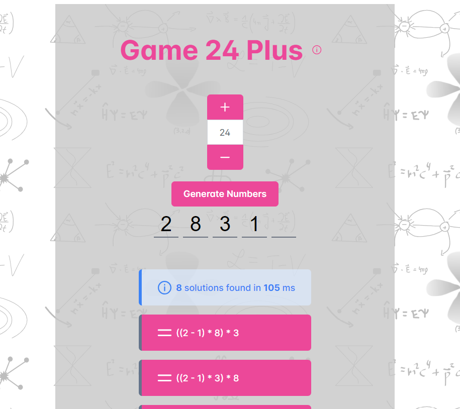

# 24-game



## What is this?

This is an extended variant of the <a href="https://en.wikipedia.org/wiki/24_(puzzle)" target="_blank">24 Puzzle</a>.

- Generate a set of numbers or come up with your own; Possible numbers are integers from 1 to 9; there should be at least three numbers up to five numbers
- Manipulate these integers in any order so that they yield 24 - or any other number that you specify in the UI;
- If you play with friends: Whoever comes up with a valid arithmetic sequence first wins
- Playing alone: Try to come up with as many different valid solutions as possible!

But in reality this is just a demonstration / exercise how to deploy a simple app to azure fully atomatically and in one click. Read further if you're interested!

## Project Setup

This project is a Vue.js application that can be dockerized and deployed to Azure using a one-click deployment script.

### Prerequisites

Before you can run the project, you need to install the following:

1. **Node.js**: This is required to run the project locally and to install the project dependencies. You can download it from [here](https://nodejs.org/).

2. **Docker**: This is required to create a Docker image of the project. The installation instructions for Docker can be found [here](https://docs.docker.com/get-docker/).

3. **Azure CLI**: This is required to deploy the Docker image to Azure. You can download it from [here](https://docs.microsoft.com/cli/azure/install-azure-cli).

### Auto Deploy App

You can build and run this app locally using Node:

```
npm install -g serve
```

or by using docker

```
docker build -t game-24 .
docker run game-24
```

But the most interesting approach is to make it accessible across the internet in one click; get an azure account and run my automated deployment script:

```
source one-click-deployment.sh
```